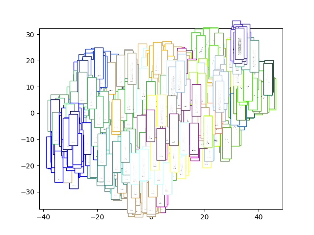
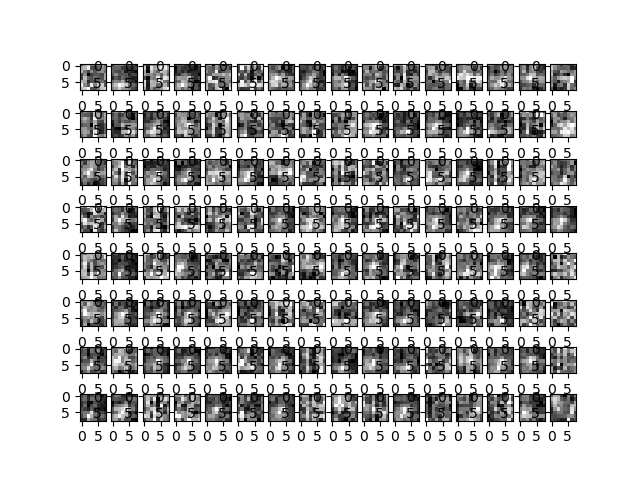
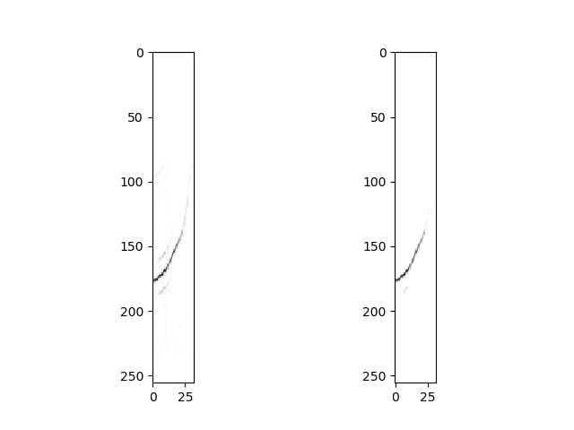
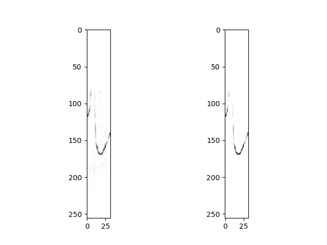
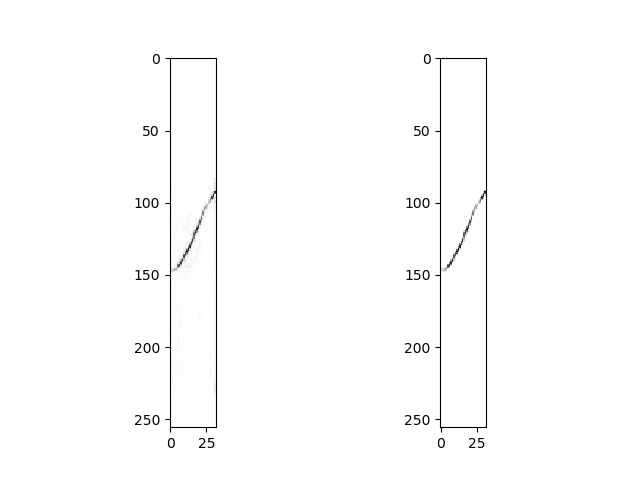
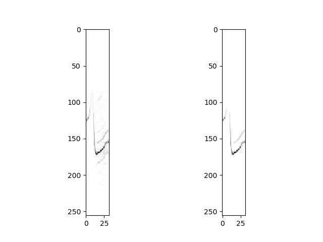

# Convnet V1

Idea: Build a convolutional auto encoder. Build a silence detector on top. 

## Data:
The data is the sound type catalog from my thesis. We slice each
audio file using a sliding window of 32 frames. The spectorgram is
computed using a window of 512 samples with a 256 sample skip.

## Model
The encoder is shown below:

```
_________________________________________________________________
Layer (type)                 Output Shape              Param #   
=================================================================
input_1 (InputLayer)         [(None, 32, 256, 1)]      0         
_________________________________________________________________
conv2d (Conv2D)              (None, 16, 128, 128)      8320      
_________________________________________________________________
leaky_re_lu (LeakyReLU)      (None, 16, 128, 128)      0         
_________________________________________________________________
conv2d_1 (Conv2D)            (None, 8, 64, 64)         524352    
_________________________________________________________________
leaky_re_lu_1 (LeakyReLU)    (None, 8, 64, 64)         0         
_________________________________________________________________
conv2d_2 (Conv2D)            (None, 4, 32, 32)         131104    
_________________________________________________________________
leaky_re_lu_2 (LeakyReLU)    (None, 4, 32, 32)         0         
_________________________________________________________________
conv2d_3 (Conv2D)            (None, 2, 16, 16)         32784     
_________________________________________________________________
leaky_re_lu_3 (LeakyReLU)    (None, 2, 16, 16)         0         
_________________________________________________________________
flatten (Flatten)            (None, 512)               0         
_________________________________________________________________
dense (Dense)                (None, 128)               65664     
_________________________________________________________________
batch_normalization (BatchNo (None, 128)               512       
_________________________________________________________________
leaky_re_lu_4 (LeakyReLU)    (None, 128)               0         
=================================================================
Total params: 762,736
Trainable params: 762,480
Non-trainable params: 256
_________________________________________________________________
```

# Offline Eval

The silence detector's confusion matrix is:

|truth/prediction|not silence|silence|
|:---|:---|:---|
|not silence|104|44|
|silence|18|724|

The embedding ... 



... zoomed into the whistle part (top right corner)


We also visualise the filters:



And some reconstructions:






# Conclusion

Results: `agglomerative_dtw_tight`

+ Worked well for clicks and bursts
+ Quite a large and slow model
+ Did not work for clicks at all

