# LSTM V4

Idea:  
 Build an LSTM stack on top of a single layer conv net as an encoder.
 The output is a single vector.
 Build a one to many lstm as a decoder follwed by a deconvolution layer.
 Build a silence detector on top. 

## Data:

***v4.1: 28.10.2019***: 
All data including clustering, thesis data and thesis catalogue.


## Model
The encoder is shown below:

```
_________________________________________________________________
Layer (type)                 Output Shape              Param #
=================================================================
input_1 (InputLayer)         [(None, 128, 256, 1)]     0
_________________________________________________________________
conv2d (Conv2D)              (None, 64, 128, 128)      8320
_________________________________________________________________
leaky_re_lu (LeakyReLU)      (None, 64, 128, 128)      0
_________________________________________________________________
conv2d_1 (Conv2D)            (None, 32, 64, 64)        524352
_________________________________________________________________
leaky_re_lu_1 (LeakyReLU)    (None, 32, 64, 64)        0
_________________________________________________________________
conv2d_2 (Conv2D)            (None, 16, 32, 32)        131104
_________________________________________________________________
leaky_re_lu_2 (LeakyReLU)    (None, 16, 32, 32)        0
_________________________________________________________________
conv2d_3 (Conv2D)            (None, 8, 16, 16)         32784
_________________________________________________________________
leaky_re_lu_3 (LeakyReLU)    (None, 8, 16, 16)         0
_________________________________________________________________
flatten (Flatten)            (None, 2048)              0
_________________________________________________________________
dense (Dense)                (None, 128)               262272
_________________________________________________________________
batch_normalization (BatchNo (None, 128)               512
_________________________________________________________________
leaky_re_lu_4 (LeakyReLU)    (None, 128)               0
=================================================================
Total params: 959,344
Trainable params: 959,088
Non-trainable params: 256
_________________________________________________________________
```

# Evaluation v5

The silence detector's confusion matrix is:

|truth/prediction|not silence|silence|
|:---|:---|:---|
|not silence|50|89|
|silence|1|740|

Will be worse. The error will be that we cut ~2/3 of the signals.

And some silent regions:

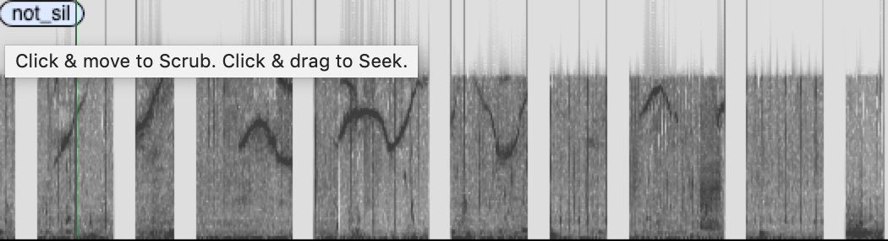


The embedding:

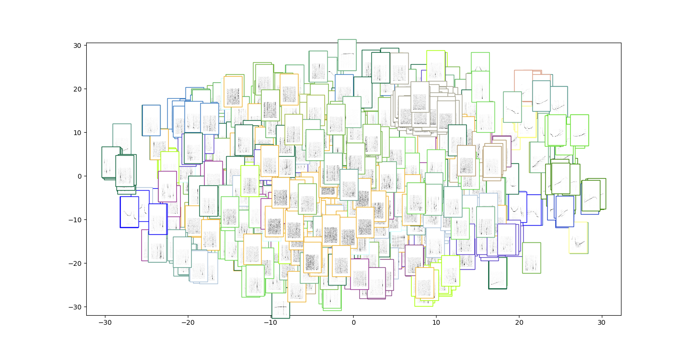

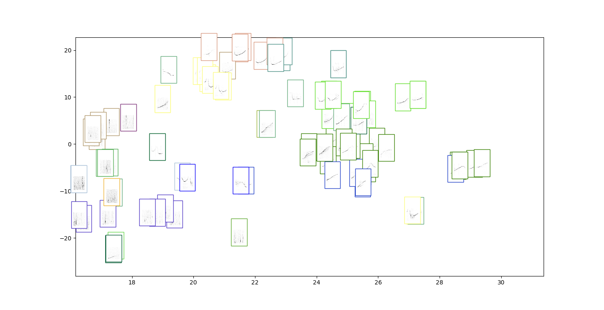

We also visualise the filters:

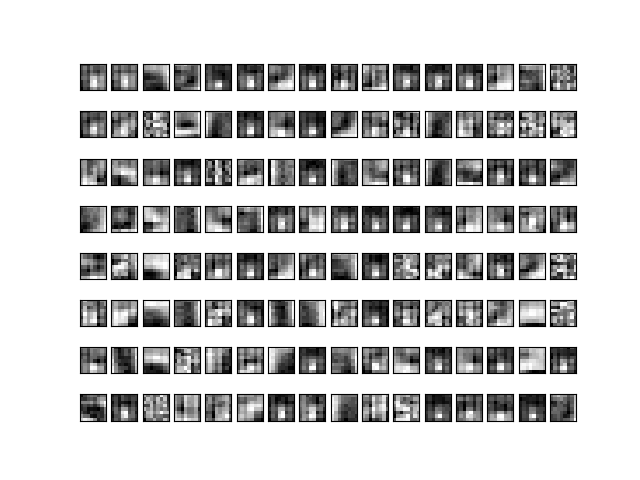


The reconstructions are shown below:

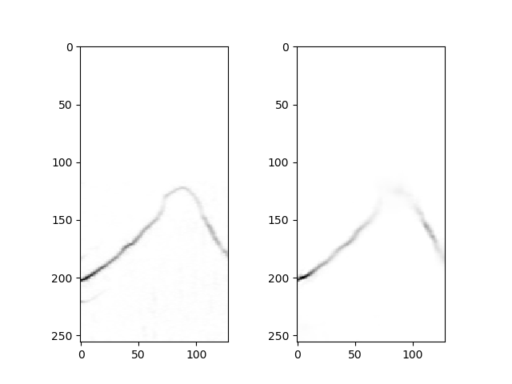

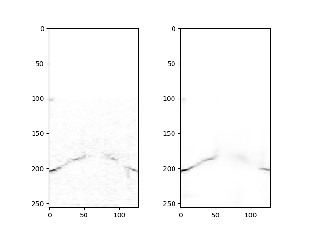
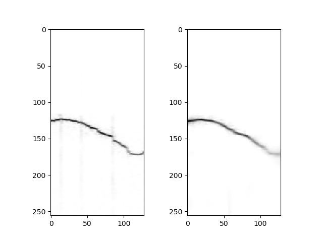
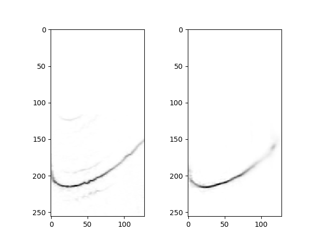
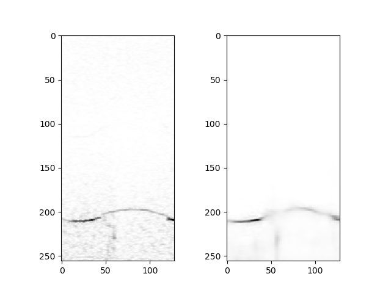

In the experiments with sequences i reduced the step size from `win / 2` to `win / 10`

Furthermore the clustering experiments:

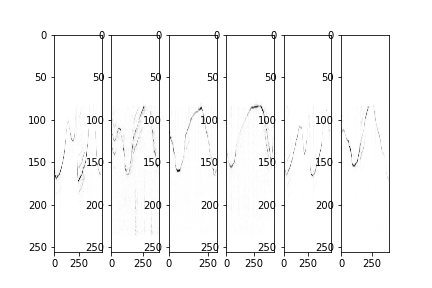
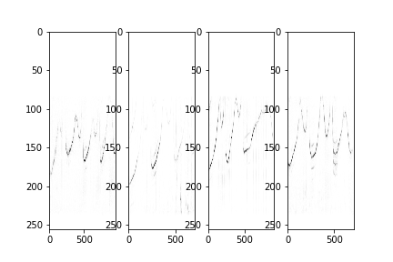
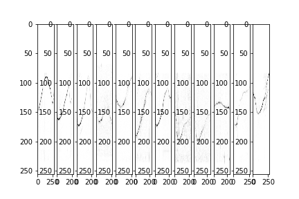
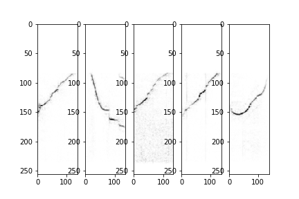
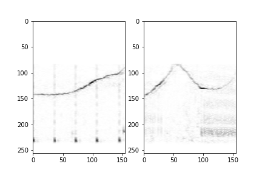
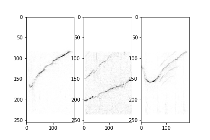
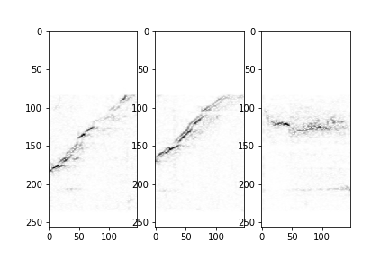


And discovery experiments:

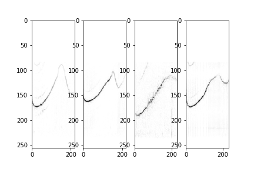
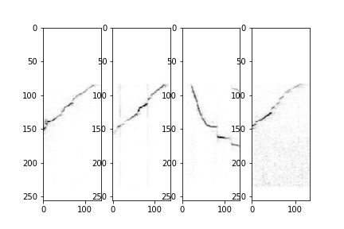
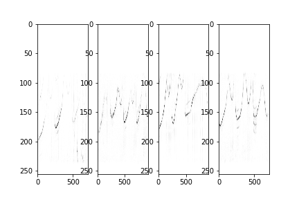
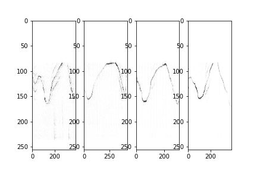
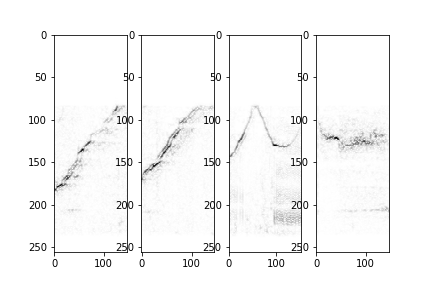
