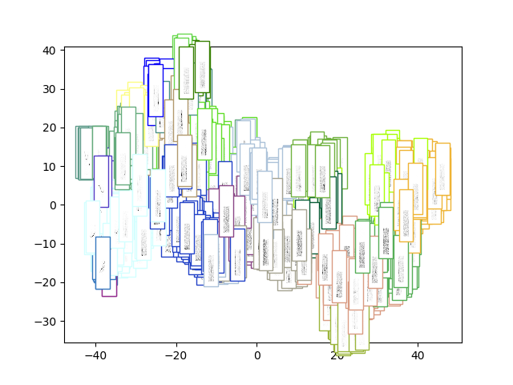
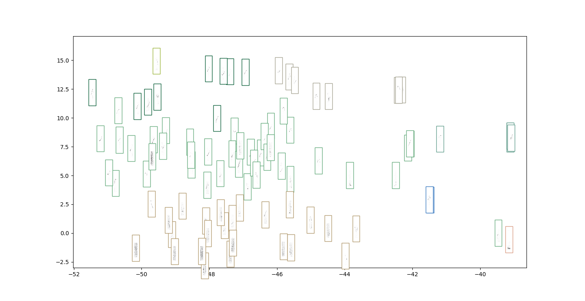
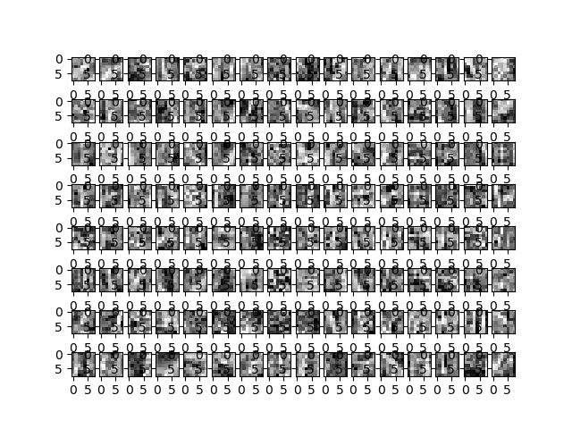

# LSTM V2

Idea: Build an LSTM stack that predicts the next element in the sequence. Build a silence detector on top. 

## Data:
The data is the sound type catalog from my thesis. We slice each
audio file using a sliding window of 32 frames. The spectorgram is
computed using a window of 512 samples with a 256 sample skip.

## Model
The encoder is shown below:

```
_________________________________________________________________
Layer (type)                 Output Shape              Param #   
=================================================================
input_1 (InputLayer)         [(None, 32, 256, 1)]      0         
_________________________________________________________________
conv2d (Conv2D)              (None, 32, 256, 128)      8320      
_________________________________________________________________
max_pooling2d (MaxPooling2D) (None, 32, 1, 128)        0         
_________________________________________________________________
reshape (Reshape)            (None, 32, 128)           0         
_________________________________________________________________
bidirectional (Bidirectional (None, 32, 64)            41216     
_________________________________________________________________
lstm_1 (LSTM)                (None, 64)                33024     
=================================================================
Total params: 82,560
Trainable params: 82,560
Non-trainable params: 0
_________________________________________________________________
```

# Offline Eval

The silence detector's confusion matrix is:

|truth/prediction|not silence|silence|
|:---|:---|:---|
|not silence|111|36|
|silence|4|737|

The embedding ... 



... zoomed into the whistle part (top right corner)



We also visualise the filters:




# Conclusion

Results: `agglomerative_dtw_lstm`

+ Silence detector finds way more (~ 6759)
+ Worked better than convnet since it also got whistles