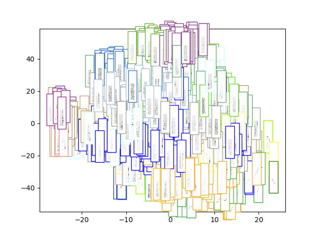
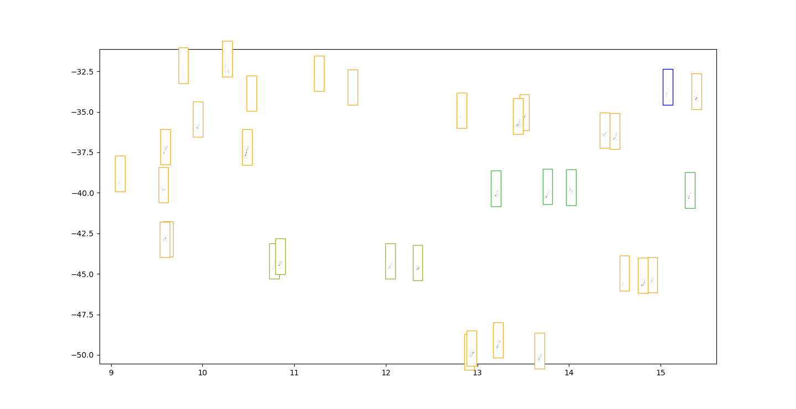
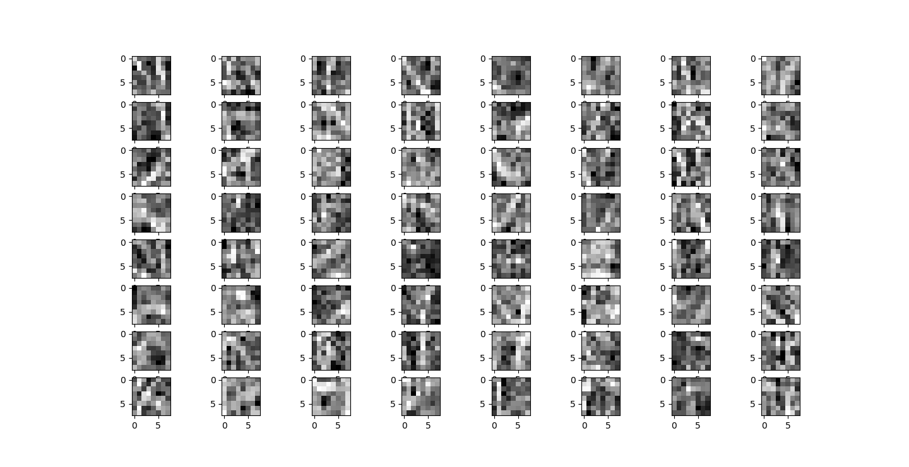
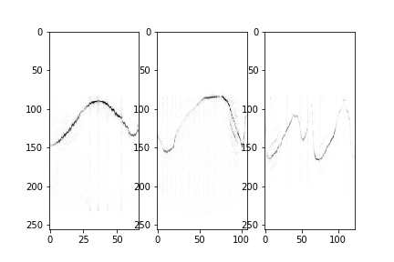
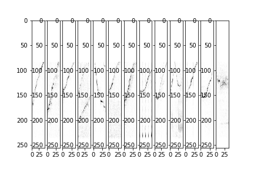
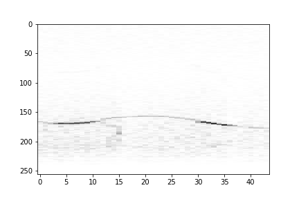
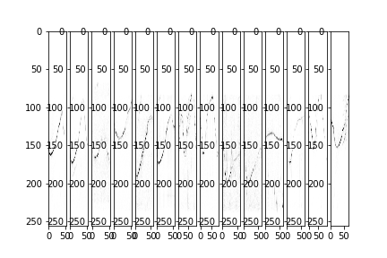
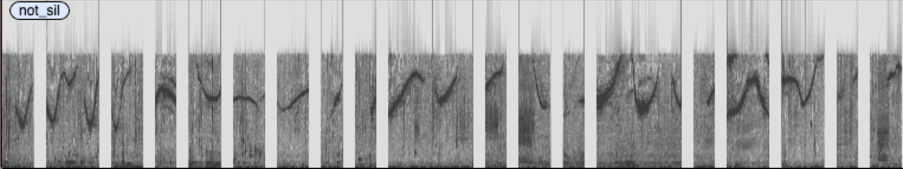
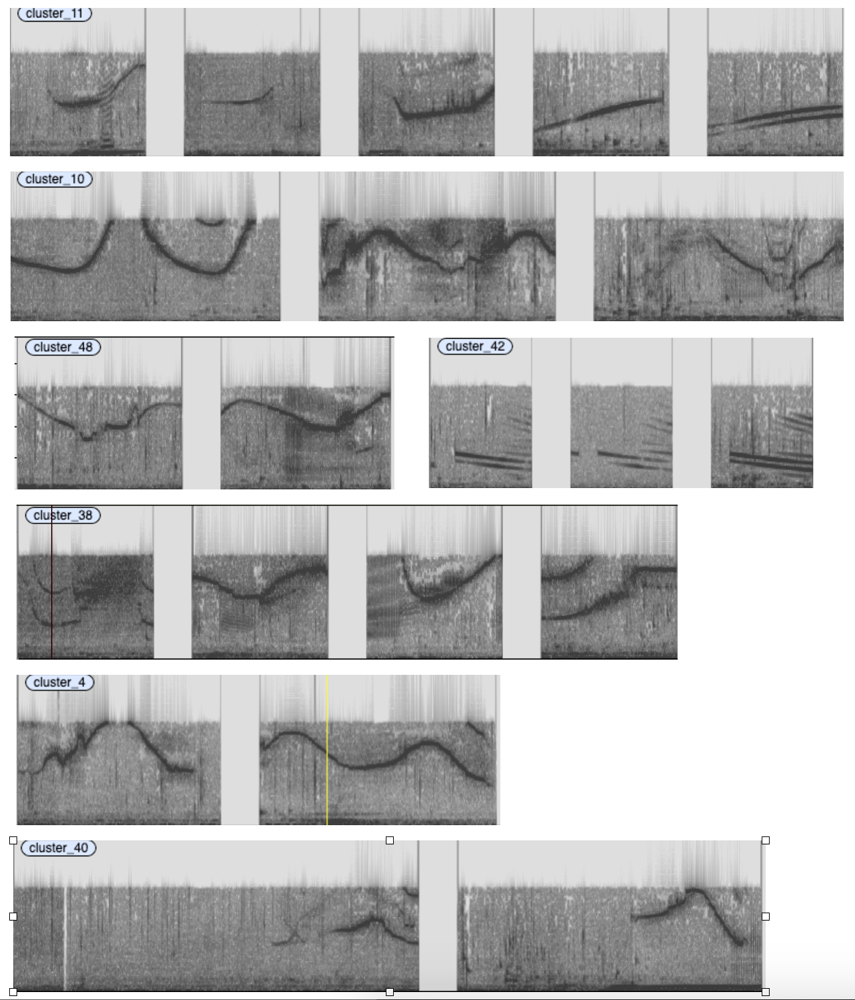

# LSTM V3

Idea:  
 Build an LSTM stack that predicts the next element in the sequence.
 The input to the LSTM is two concatenated conv nets. One spanning
 the whole spectrogram, the other using patches from the spectrogram.
 In this way we can model local and global information.
 Build a silence detector on top. 

## Data:

***v3.1: 28.10.2019***: 
The data is the sound type catalog from my thesis. We slice each
audio file using a sliding window of 32 frames. The spectorgram is
computed using a window of 512 samples with a 256 sample skip.

***v3.2: 29.10.2019***:
Same as 3.1 but adding all cluster files from the last run.

## Model
The encoder is shown below:

```
Layer (type)                    Output Shape         Param #     Connected to                     
==================================================================================================
input_1 (InputLayer)            [(None, 32, 256, 1)] 0                                            
__________________________________________________________________________________________________
conv2d (Conv2D)                 (None, 32, 256, 64)  4160        input_1[0][0]                    
__________________________________________________________________________________________________
max_pooling2d (MaxPooling2D)    (None, 32, 1, 64)    0           conv2d[0][0]                     
__________________________________________________________________________________________________
reshape_1 (Reshape)             (None, 32, 256)      0           input_1[0][0]                    
__________________________________________________________________________________________________
reshape (Reshape)               (None, 32, 64)       0           max_pooling2d[0][0]              
__________________________________________________________________________________________________
conv1d (Conv1D)                 (None, 32, 64)       131136      reshape_1[0][0]                  
__________________________________________________________________________________________________
concatenate (Concatenate)       (None, 32, 128)      0           reshape[0][0]                    
                                                                 conv1d[0][0]                     
__________________________________________________________________________________________________
bidirectional (Bidirectional)   (None, 32, 64)       41216       concatenate[0][0]                
__________________________________________________________________________________________________
lstm_1 (LSTM)                   (None, 128)          98816       bidirectional[0][0]              
==================================================================================================
Total params: 275,328
Trainable params: 275,328
Non-trainable params: 0
__________________________________________________________________________________________________
```

# Evaluation v3.1

The silence detector's confusion matrix is:

|truth/prediction|not silence|silence|
|:---|:---|:---|
|not silence|66|81|
|silence|1|740|

The embedding ... 



... zoomed into the whistle part (top right corner)



We also visualise the filters:



Here are some clusters from the offline experiment:







And some of the silent regions



It is the first one where the clustering starts working



Silence detector finds way more (~ 2690)
