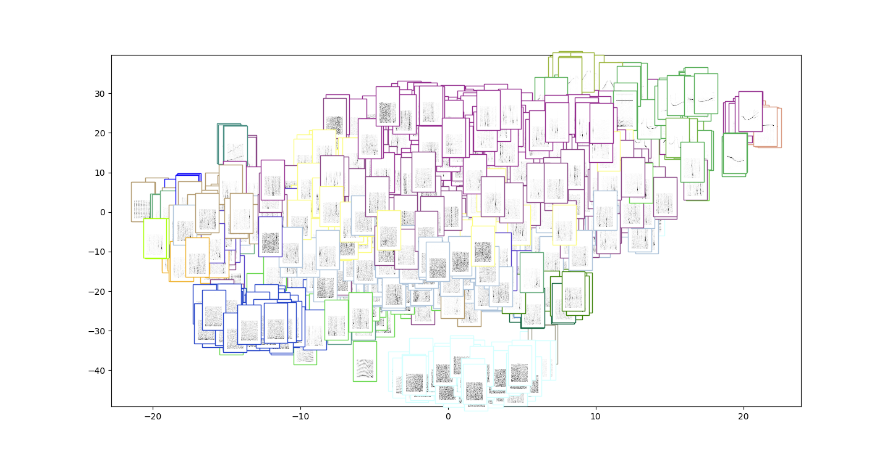
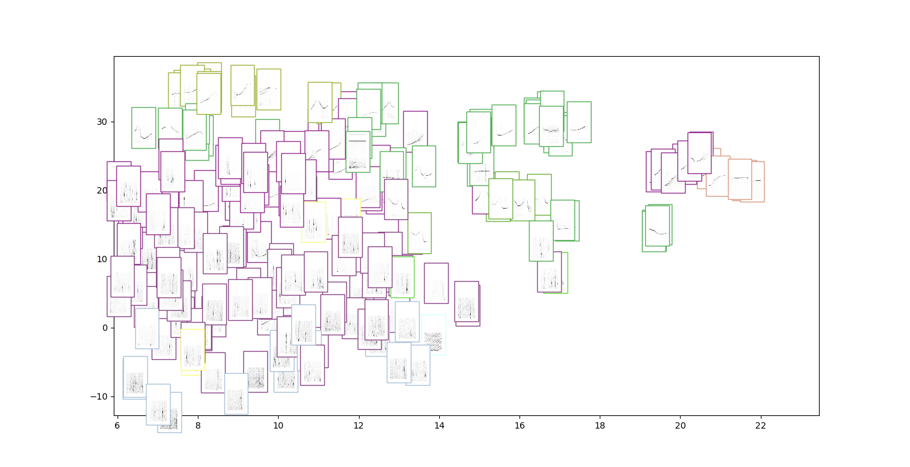
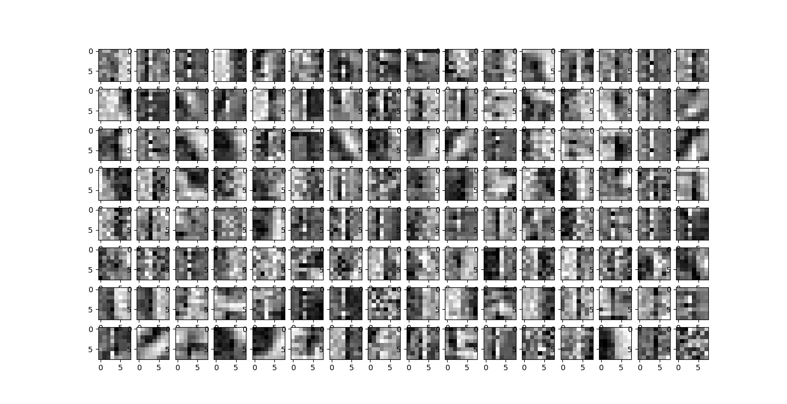
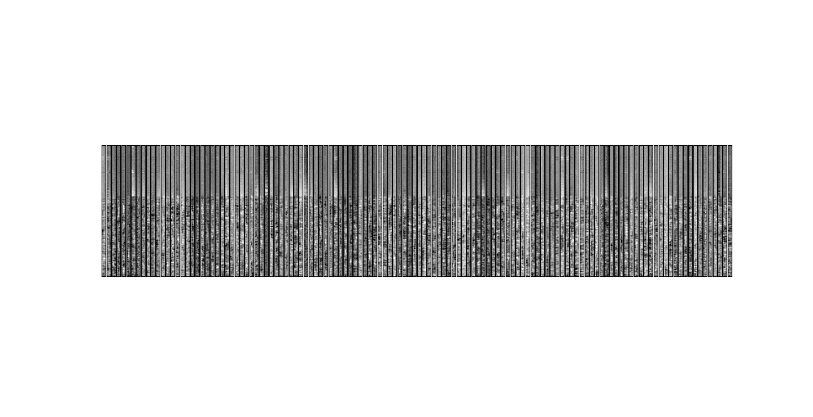
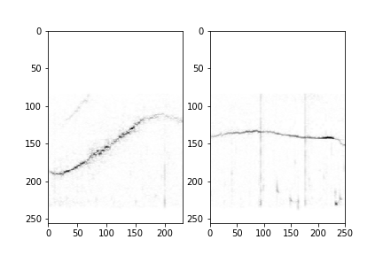
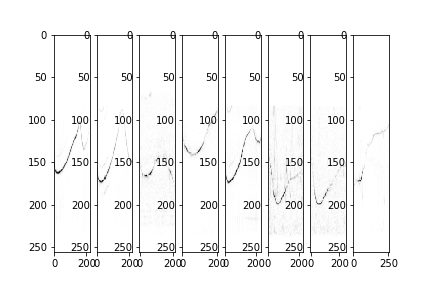
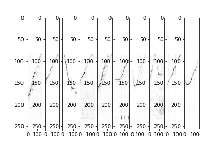
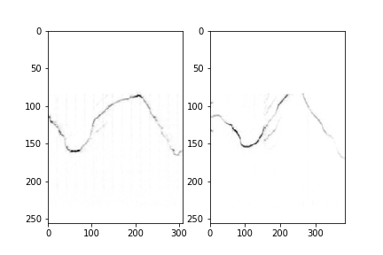

# LSTM V3

Idea:  
 Build an LSTM stack that predicts the next element in the sequence.
 The input to the LSTM is two concatenated conv nets. One spanning
 the whole spectrogram, the other using patches from the spectrogram.
 In this way we can model local and global information.
 Build a silence detector on top. 

## Data:

***v3.1: 28.10.2019***: 
The data is the sound type catalog from my thesis. We slice each
audio file using a sliding window of 32 frames. The spectorgram is
computed using a window of 512 samples with a 256 sample skip.

***v3.2: 29.10.2019***:
Same as 3.1 but adding all cluster files from the last run.

***v3.3: 30.10.2019***:
More parameters

***v3.4: 30.10.2019***:
Larger input (128 frames) smaller skip for dft (64) all data.

***v3.5 31.10.2019***:
Catalgoue + Clusters + Thesis2012

***v3.6 01.11.2019***:
Catalgoue + silence + Thesis2012


## Model
The encoder is shown below:

```
__________________________________________________________________________________________________
Layer (type)                    Output Shape         Param #     Connected to                     
==================================================================================================
input_1 (InputLayer)            [(None, 128, 256, 1) 0                                            
__________________________________________________________________________________________________
conv2d (Conv2D)                 (None, 128, 256, 128 8320        input_1[0][0]                    
__________________________________________________________________________________________________
max_pooling2d (MaxPooling2D)    (None, 128, 1, 128)  0           conv2d[0][0]                     
__________________________________________________________________________________________________
reshape_1 (Reshape)             (None, 128, 256)     0           input_1[0][0]                    
__________________________________________________________________________________________________
reshape (Reshape)               (None, 128, 128)     0           max_pooling2d[0][0]              
__________________________________________________________________________________________________
conv1d (Conv1D)                 (None, 128, 128)     262272      reshape_1[0][0]                  
__________________________________________________________________________________________________
concatenate (Concatenate)       (None, 128, 256)     0           reshape[0][0]                    
                                                                 conv1d[0][0]                     
__________________________________________________________________________________________________
batch_normalization (BatchNorma (None, 128, 256)     1024        concatenate[0][0]                
__________________________________________________________________________________________________
bidirectional (Bidirectional)   (None, 128, 512)     1050624     batch_normalization[0][0]        
__________________________________________________________________________________________________
lstm_1 (LSTM)                   (None, 128)          328192      bidirectional[0][0]              
==================================================================================================
Total params: 1,650,432
Trainable params: 1,649,920
Non-trainable params: 512
__________________________________________________________________________________________________
```

# Evaluation v3.5

The silence detector's confusion matrix is:

|truth/prediction|not silence|silence|
|:---|:---|:---|
|not silence|139|0|
|silence|0|741|

 
The embedding ... 



... zoomed into the whistle part (top right corner)



We also visualise the filters:




Here are some clusters from the offline experiment:




