# LSTM V4

Idea:  
 Build an LSTM stack on top of a single layer conv net as an encoder.
 The output is a single vector.
 Build a one to many lstm as a decoder follwed by a deconvolution layer.
 Build a silence detector on top. 

## Data:

***v4.1: 28.10.2019***: 
All data including clustering, thesis data and thesis catalogue.


## Model
The encoder is shown below:

```
_________________________________________________________________
Layer (type)                 Output Shape              Param #
=================================================================
input_1 (InputLayer)         [(None, 128, 256, 1)]     0
_________________________________________________________________
conv2d (Conv2D)              (None, 128, 256, 256)     16640
_________________________________________________________________
max_pooling2d (MaxPooling2D) (None, 128, 1, 256)       0
_________________________________________________________________
reshape (Reshape)            (None, 128, 256)          0
_________________________________________________________________
batch_normalization (BatchNo (None, 128, 256)          1024
_________________________________________________________________
bidirectional (Bidirectional (None, 128, 256)          394240
_________________________________________________________________
lstm_1 (LSTM)                (None, 128)               197120
=================================================================
Total params: 609,024
Trainable params: 608,512
Non-trainable params: 512
_________________________________________________________________
```

# Evaluation v3.8

The silence detector's confusion matrix is:

|truth/prediction|not silence|silence|
|:---|:---|:---|
|not silence|||
|silence|||

 
The embedding:

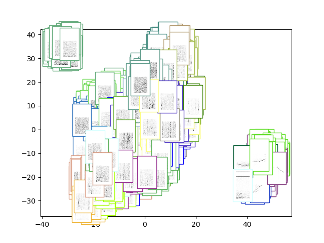

As one can see, the space seems to be split into three clouds.
The top left seems to contain actual silence:

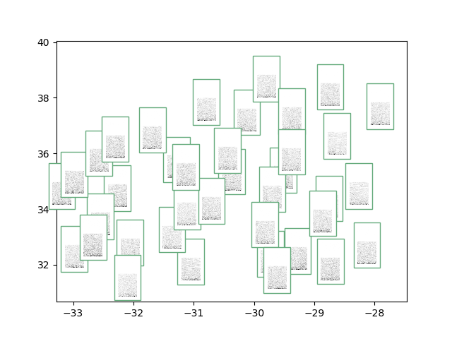

The lower right seems to contain whistles:

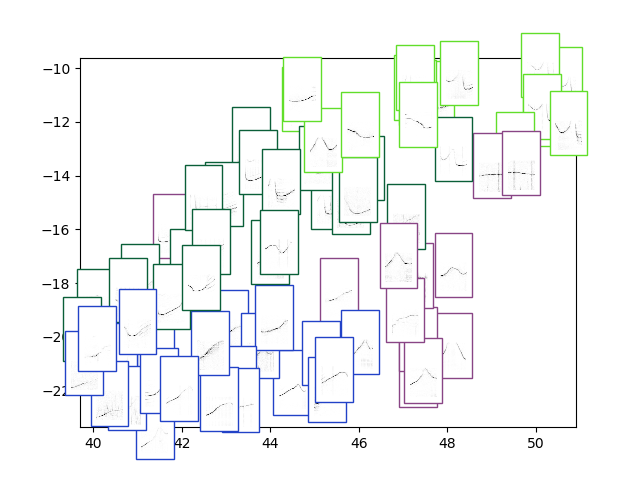

The rest seems to be a mixture of underwater noises, click trains and burst pulses. So mostly click based sounds:

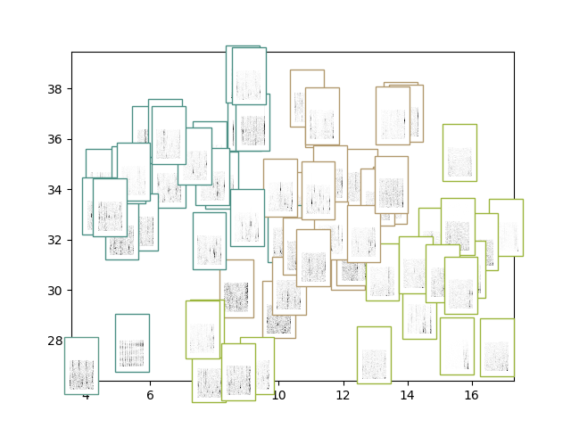


We also visualise the filters:

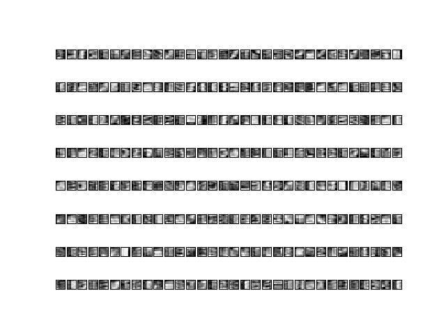

The reconstructions are shown below:

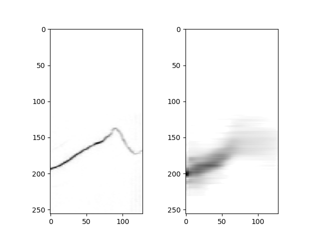
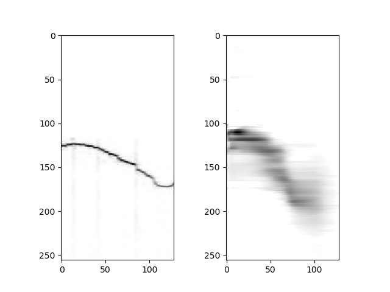
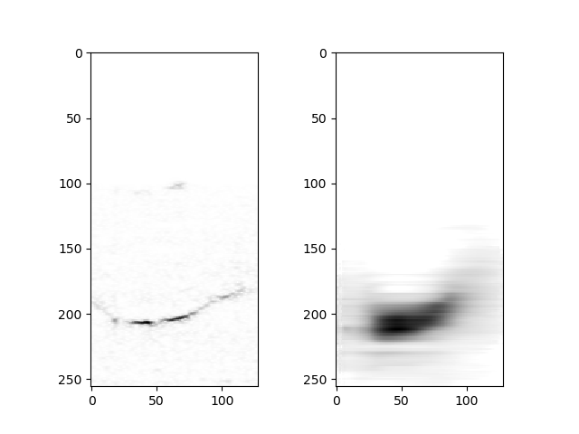
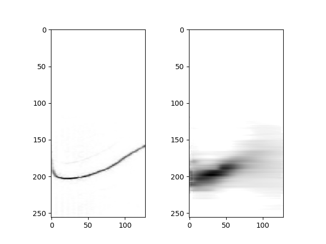
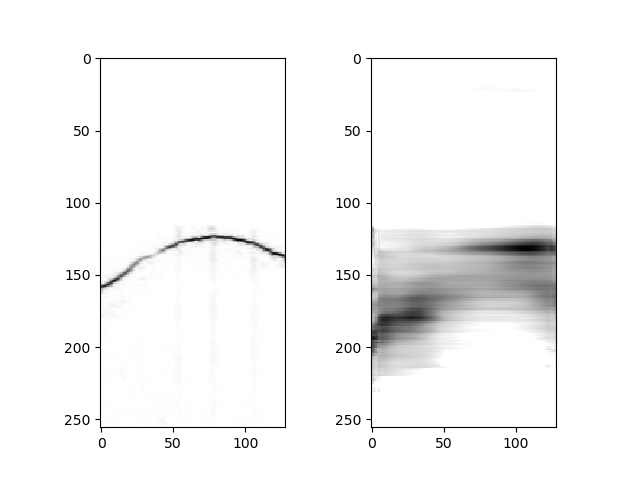
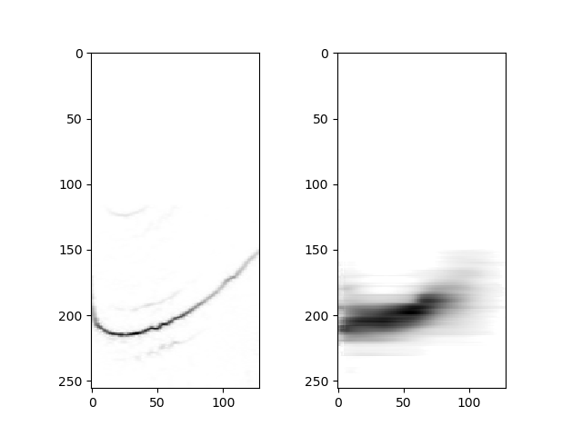

Furthermore the clustering experiments:

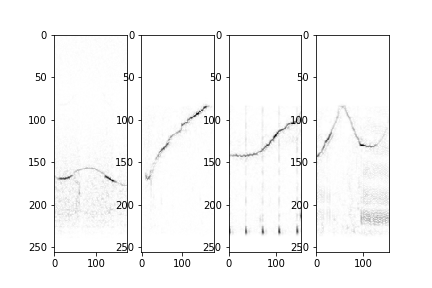
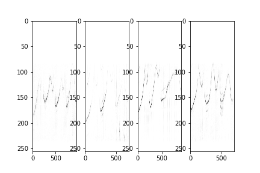
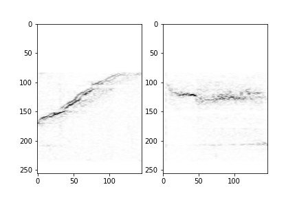
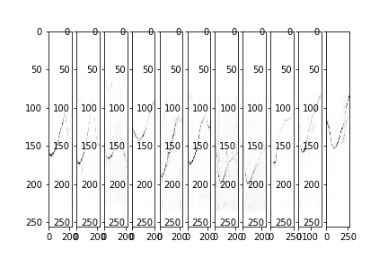


And discovery experiments:

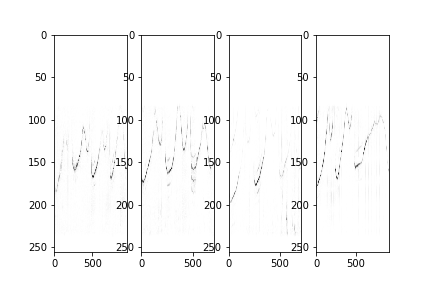
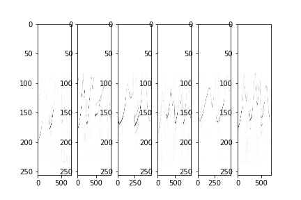

