# LSTM V4

Idea:  
 Build an LSTM stack on top of a single layer conv net as an encoder.
 The output is a single vector.
 Build a one to many lstm as a decoder follwed by a deconvolution layer.
 Build a silence detector on top. 

## Data:

***v4.1: 28.10.2019***: 
All data including clustering, thesis data and thesis catalogue.

***v4.2: 08.11.2019***
All data as above. Train using variational loss / layer between the encoder and decoder

## Model
The encoder is shown below:

```
__________________________________________________________________________________________________
Model: "model"
__________________________________________________________________________________________________
Layer (type)                    Output Shape         Param #     Connected to                     
==================================================================================================
input_1 (InputLayer)            [(None, 128, 256, 1) 0                                            
__________________________________________________________________________________________________
conv2d (Conv2D)                 (None, 128, 256, 256 16640       input_1[0][0]                    
__________________________________________________________________________________________________
max_pooling2d (MaxPooling2D)    (None, 128, 1, 256)  0           conv2d[0][0]                     
__________________________________________________________________________________________________
reshape (Reshape)               (None, 128, 256)     0           max_pooling2d[0][0]              
__________________________________________________________________________________________________
bidirectional (Bidirectional)   (None, 128, 256)     394240      reshape[0][0]                    
__________________________________________________________________________________________________
lstm_1 (LSTM)                   (None, 128)          197120      bidirectional[0][0]              
__________________________________________________________________________________________________
dense (Dense)                   (None, 128)          16512       lstm_1[0][0]                     
__________________________________________________________________________________________________
dense_1 (Dense)                 (None, 128)          16512       lstm_1[0][0]                     
__________________________________________________________________________________________________
encoder_output (Lambda)         (None, 128)          0           dense[0][0]                      
                                                                 dense_1[0][0]                    
==================================================================================================
Total params: 641,024
Trainable params: 641,024
Non-trainable params: 0
__________________________________________________________________________________________________
```

# Evaluation v4.2

The silence detector's confusion matrix is:

|truth/prediction|not silence|silence|
|:---|:---|:---|
|not silence|107|32|
|silence|16|725|


And some silent regions:

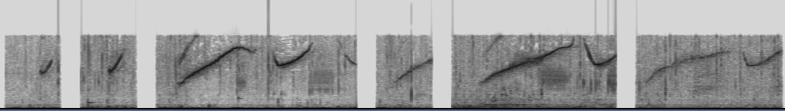


The embedding:

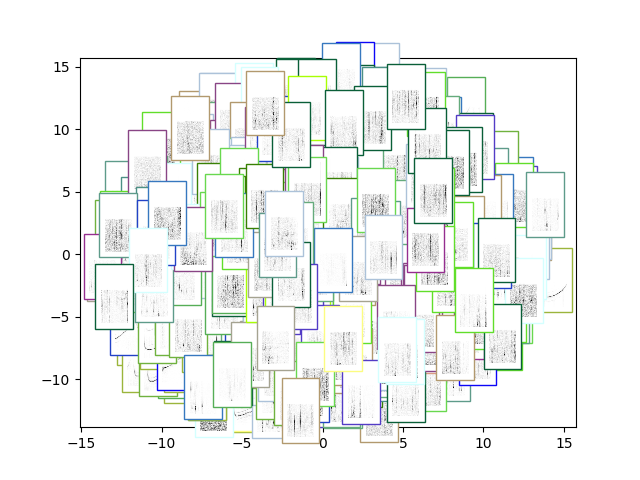

We also visualise the filters:

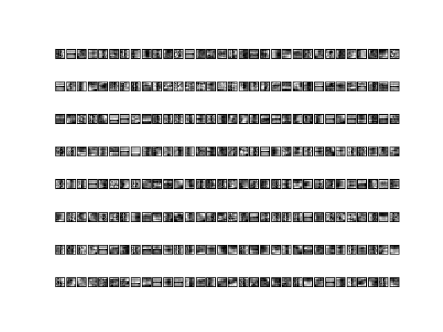

The reconstructions are shown below:

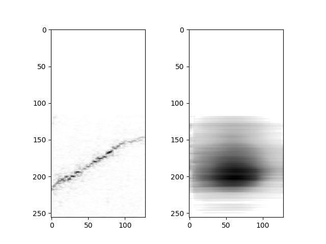
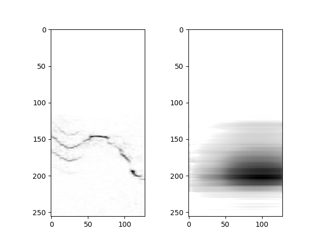
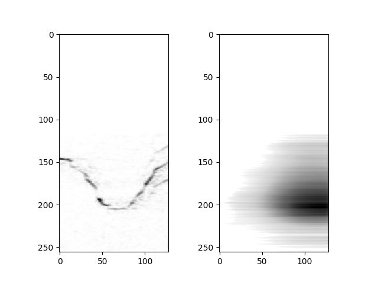
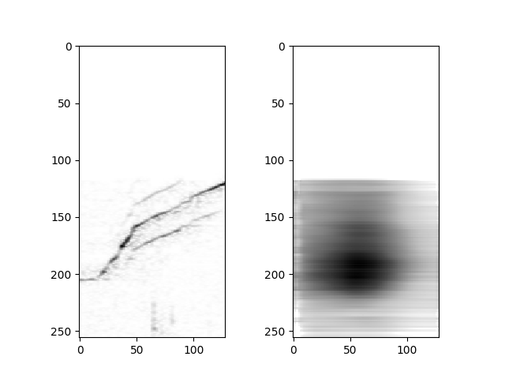
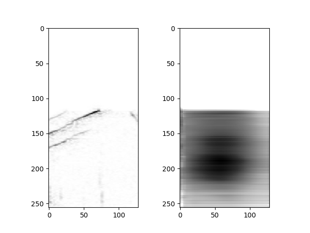
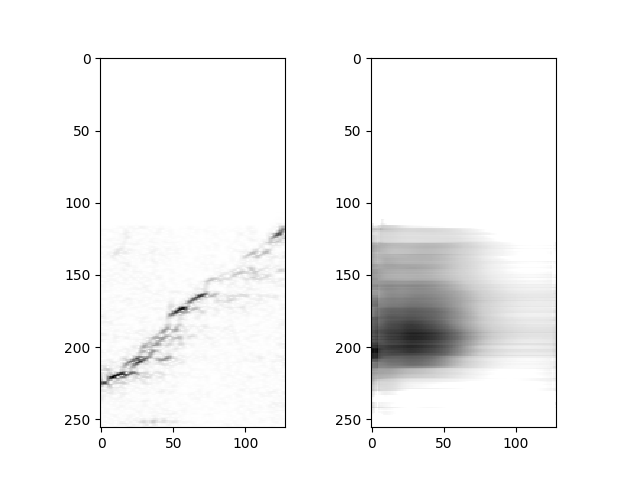

In the experiments with sequences i reduced the step size from `win / 2` to `win / 10`

Furthermore the clustering experiments:

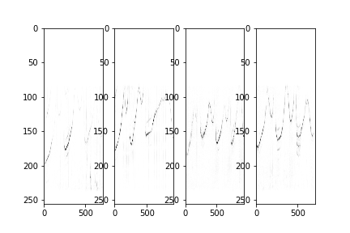
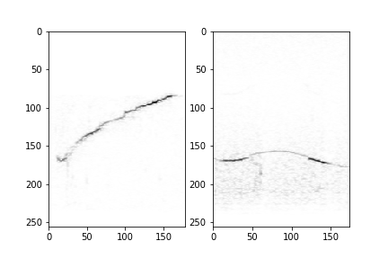
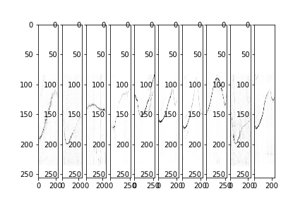
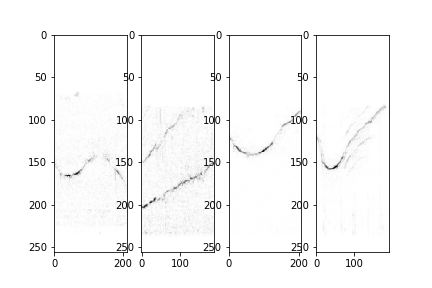
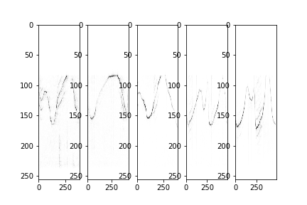
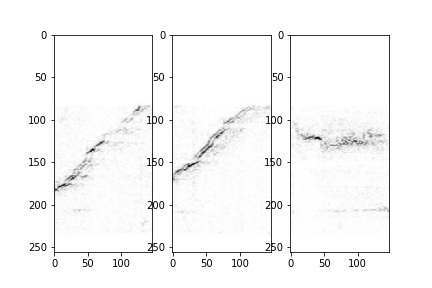

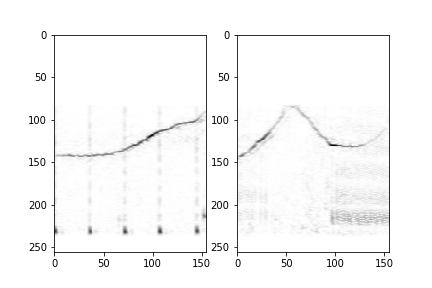
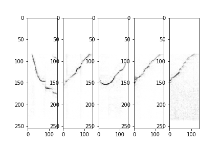

And discovery experiments:

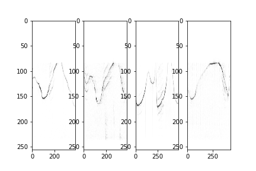
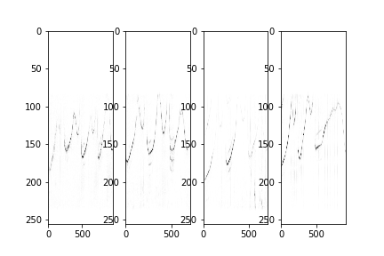
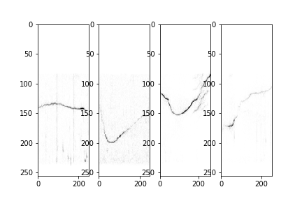
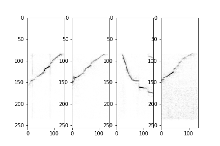
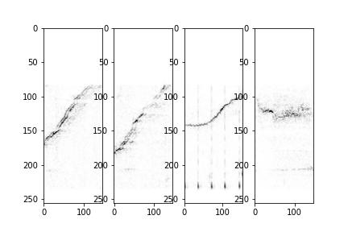

So far this encoder is one of the best ones. Even if the
reconstructions seem to be shitty.

The discovery experiment on the actual data is:

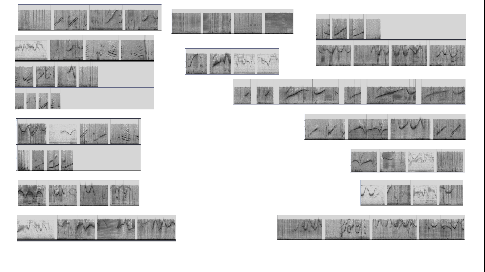
