# LSTM V4

Idea:  
 Build an LSTM stack on top of a single layer conv net as an encoder.
 The output is a single vector.
 Build a one to many lstm as a decoder follwed by a deconvolution layer.
 Build a silence detector on top. 

## Data:

***v4.1: 28.10.2019***: 
All data including clustering, thesis data and thesis catalogue.

***v4.2: 08.11.2019***
All data as above. Train using variational loss / layer between the encoder and decoder

***v4.3: 11.11.2019***
All data as above + discovery results. Decreasing model size (128 filters) and
changing output activation from `relu` to `linear`.

## Model
The encoder is shown below:

```
_________________________________________________________________
Layer (type)                 Output Shape              Param #
=================================================================
input_1 (InputLayer)         [(None, 128, 256, 1)]     0
_________________________________________________________________
conv2d (Conv2D)              (None, 128, 256, 128)     8320
_________________________________________________________________
max_pooling2d (MaxPooling2D) (None, 128, 1, 128)       0
_________________________________________________________________
reshape (Reshape)            (None, 128, 128)          0
_________________________________________________________________
batch_normalization (BatchNo (None, 128, 128)          512
_________________________________________________________________
bidirectional (Bidirectional (None, 128, 256)          263168
_________________________________________________________________
lstm_1 (LSTM)                (None, 128)               197120
=================================================================
Total params: 469,120
Trainable params: 468,864
Non-trainable params: 256
_________________________________________________________________
```

# Evaluation v4.3

The silence detector's confusion matrix is:

|truth/prediction|not silence|silence|
|:---|:---|:---|
|not silence|139|0|
|silence|0|741|

And some silent regions:

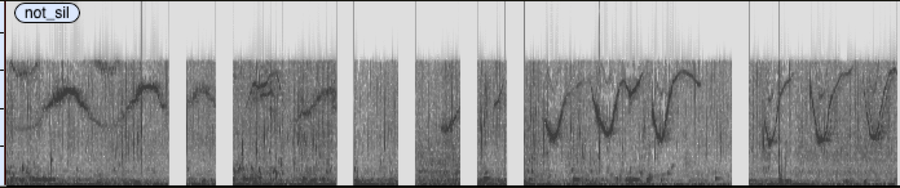


The embedding:

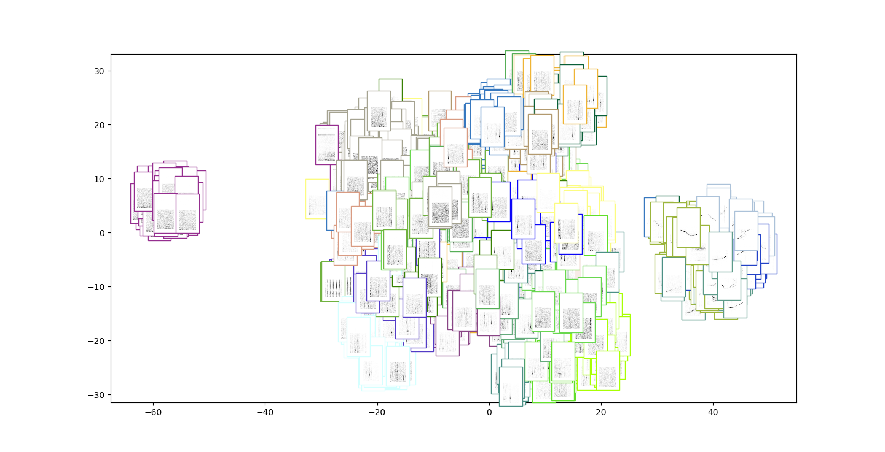
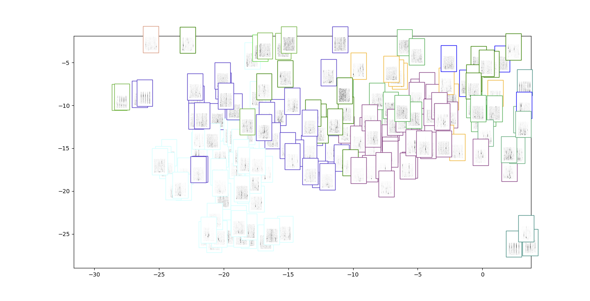
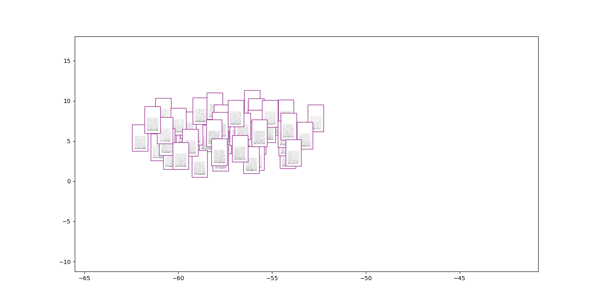
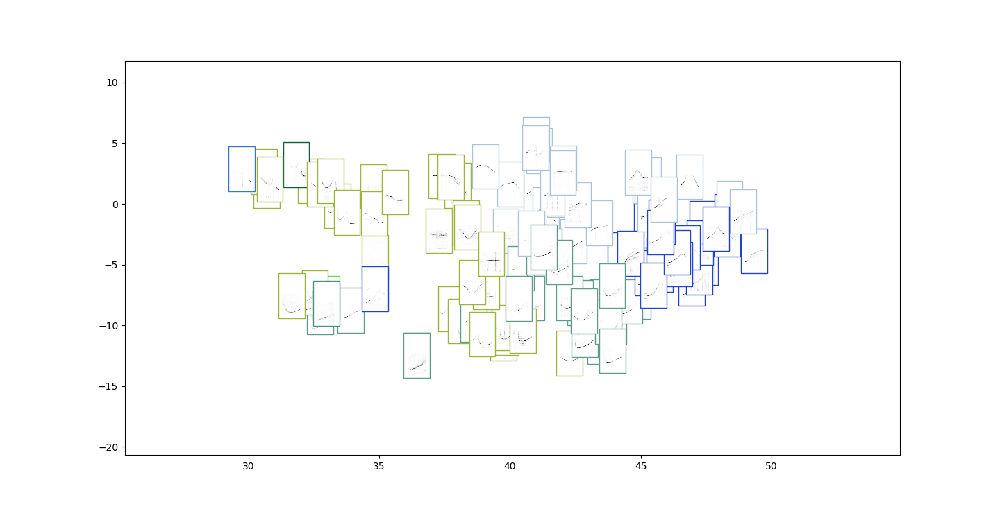

We also visualise the filters:

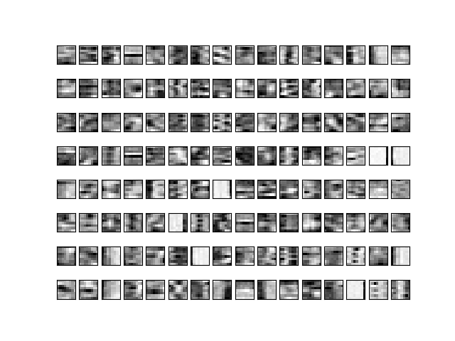

The reconstructions are shown below:

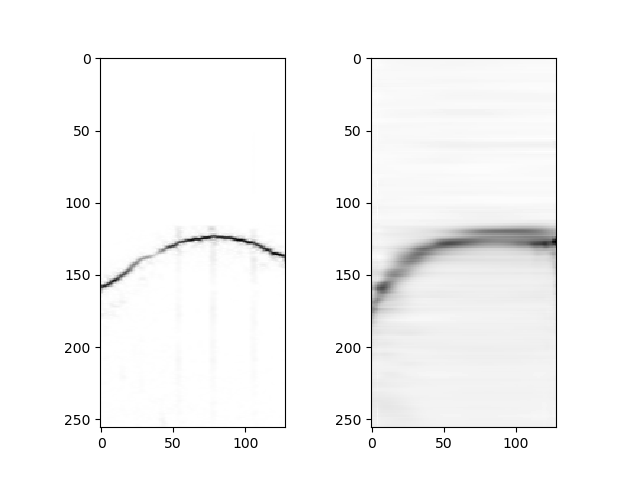
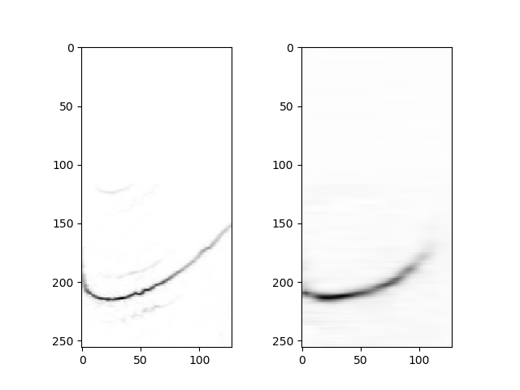
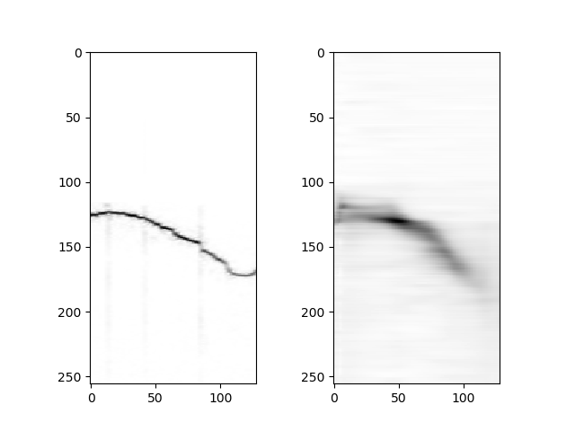
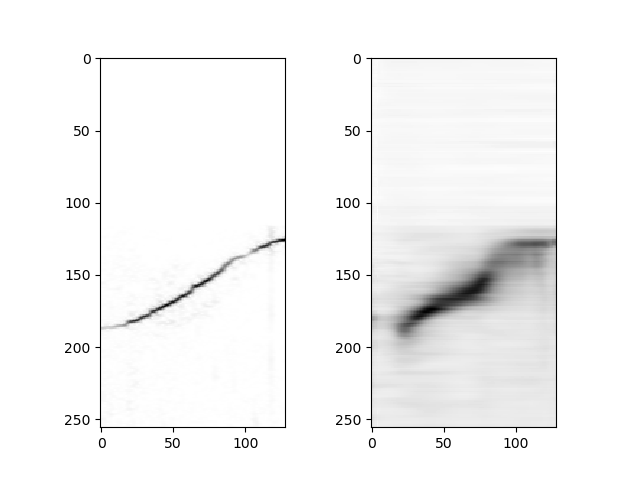
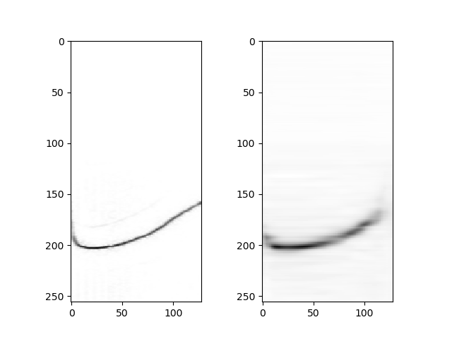

In the experiments with sequences i reduced the step size from `win / 2` to `win / 10`

Furthermore the clustering experiments:

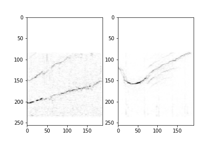
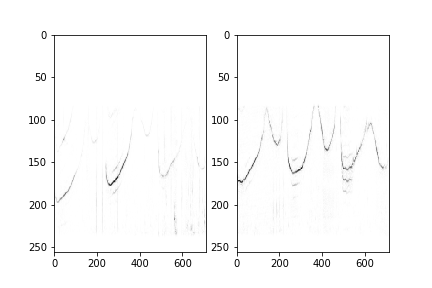
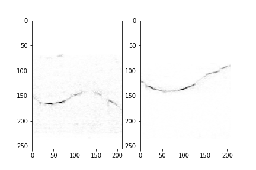
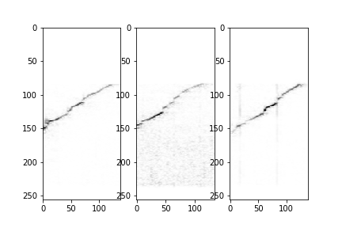
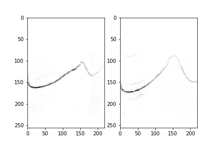
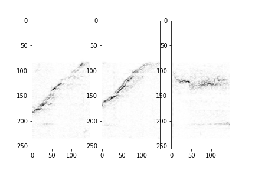

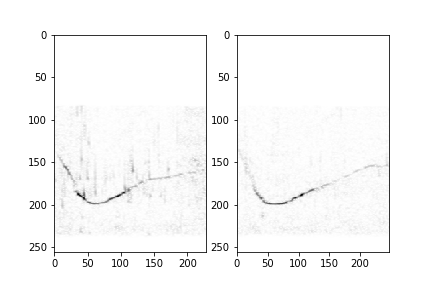
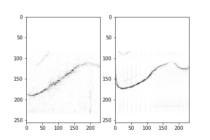

And discovery experiments:

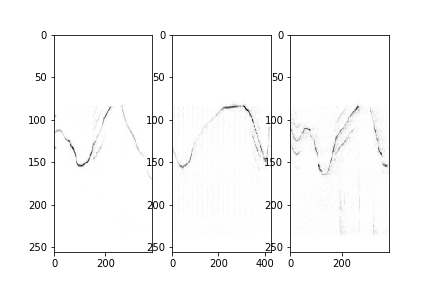
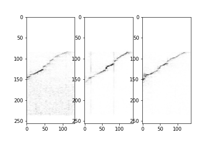
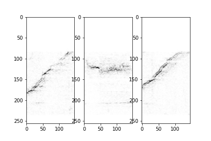

So far this encoder is one of the best ones. Even if the
reconstructions seem to be shitty.

The discovery experiment on the actual data is:
