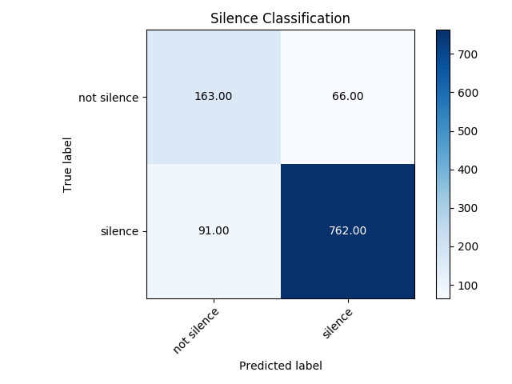

# Model Report: v2.0
    
This is the report from the training and testing runs.

### Content    
   - 1) Model Architecture
   - 2) Feature Extraction Parameters
   - 3) Classification Experiment
   - 4) Clustering Experiment
    
## 1) Model Architecture    
The encoder that is used to extract features from the audio windows:
```
_________________________________________________________________
Layer (type)                 Output Shape              Param #   
=================================================================
input_1 (InputLayer)         [(None, 128, 256, 1)]     0         
_________________________________________________________________
conv2d (Conv2D)              (None, 128, 256, 256)     16640     
_________________________________________________________________
max_pooling2d (MaxPooling2D) (None, 128, 1, 256)       0         
_________________________________________________________________
reshape (Reshape)            (None, 128, 256)          0         
_________________________________________________________________
batch_normalization (BatchNo (None, 128, 256)          1024      
_________________________________________________________________
bidirectional (Bidirectional (None, 128, 512)          1050624   
_________________________________________________________________
lstm_1 (LSTM)                (None, 256)               787456    
=================================================================
Total params: 1,855,744
Trainable params: 1,855,232
Non-trainable params: 512
_________________________________________________________________
```
    
The complete auto encoder for unsupervised training:
```
_________________________________________________________________
Layer (type)                 Output Shape              Param #   
=================================================================
input_3 (InputLayer)         [(None, 128, 256, 1)]     0         
_________________________________________________________________
model (Model)                (None, 256)               1855744   
_________________________________________________________________
model_1 (Model)              (None, 128, 256, 1)       936449    
=================================================================
Total params: 2,792,193
Trainable params: 2,791,681
Non-trainable params: 512
_________________________________________________________________
```
    
Silence detector:
```
_________________________________________________________________
Layer (type)                 Output Shape              Param #   
=================================================================
input_3 (InputLayer)         [(None, 128, 256, 1)]     0         
_________________________________________________________________
model (Model)                (None, 256)               1855744   
_________________________________________________________________
model_1 (Model)              (None, 128, 256, 1)       936449    
=================================================================
Total params: 2,792,193
Trainable params: 2,791,681
Non-trainable params: 512
_________________________________________________________________
```     

## 2) Feature Extraction
The parameters to extract the features from the audio files are listed in the table below:    

    |Parameter|Value|
    |:--- |:---|
    |DFT Win |512|
    |DFT Skip|64|
    |Spetrogram Win |128|
    |Spetrogram Skip|64|
    |Highpass|25|
    |K-Means|64|
    
    
## 3) Classification Experiment

    
## 4) Clustering Experiment 

        